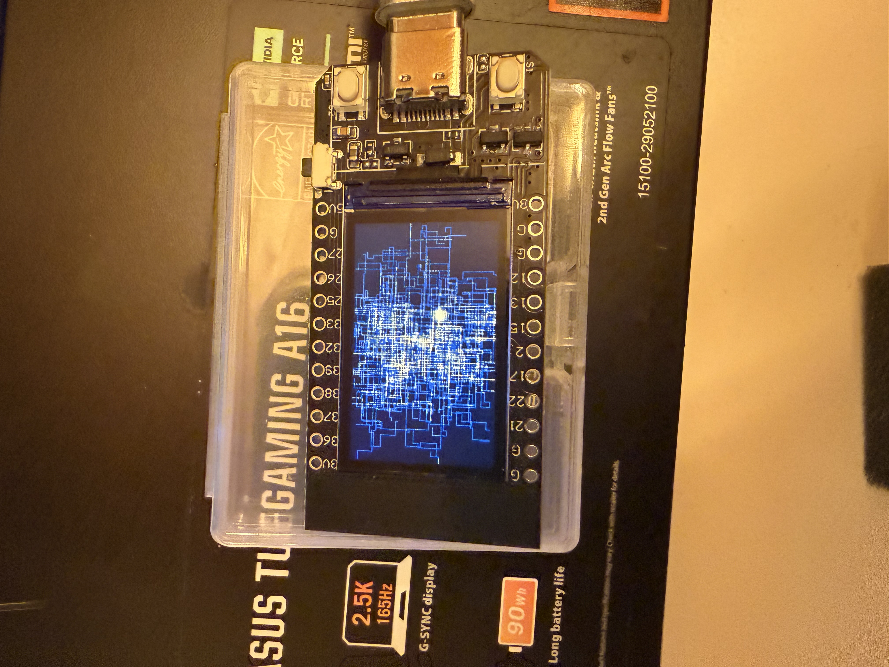

# T-Display City Screensaver

A procedural city generator for the TTGO T-Display ESP32, creating mesmerizing night satellite imagery in real-time.




## What It Does

Simulates organic city growth from a single point, drawing roads and districts that spread across the screen like a living satellite photo at night. Agents wander the grid laying down "roads" while bright nodes bloom into dense urban centers.

## Hardware

- **TTGO T-Display** (ESP32 with 1.14" ST7789 LCD, 240x135)
- Or compatible ESP32 + ST7789 display with matching pinout

## Building

Requires [PlatformIO](https://platformio.org/).

```bash
# Clone the repo
git clone https://github.com/bneidlinger/t-display-cityscreensaver.git
cd t-display-cityscreensaver

# Copy the starter config
cp starter_platformio.ini platformio.ini

# Build and upload
pio run -e tdisplay -t upload

# Monitor serial output (optional)
pio device monitor -b 115200
```

## Controls

| Button | Action |
|--------|--------|
| Left (GPIO0) | Cycle speed: SLOW → MED → FAST → TURBO |
| Right (GPIO35) | Reset simulation |

## How It Works

1. **Agents** start at the center and walk outward, depositing light intensity as "roads"
2. Agents randomly **turn** and **branch** into new agents, creating organic street networks
3. **Bright nodes** periodically bloom, simulating stadiums or dense districts
4. Dead agents **respawn** near existing lit areas, expanding the city outward
5. Minimal decay keeps the city persistent while preventing full saturation

## Pin Configuration

Defined in `starter_platformio.ini` build flags for TFT_eSPI:

| Function | GPIO |
|----------|------|
| TFT_MOSI | 19 |
| TFT_SCLK | 18 |
| TFT_CS | 5 |
| TFT_DC | 16 |
| TFT_RST | 23 |
| TFT_BL | 4 |
| BTN_LEFT | 0 |
| BTN_RIGHT | 35 |

## License

MIT
